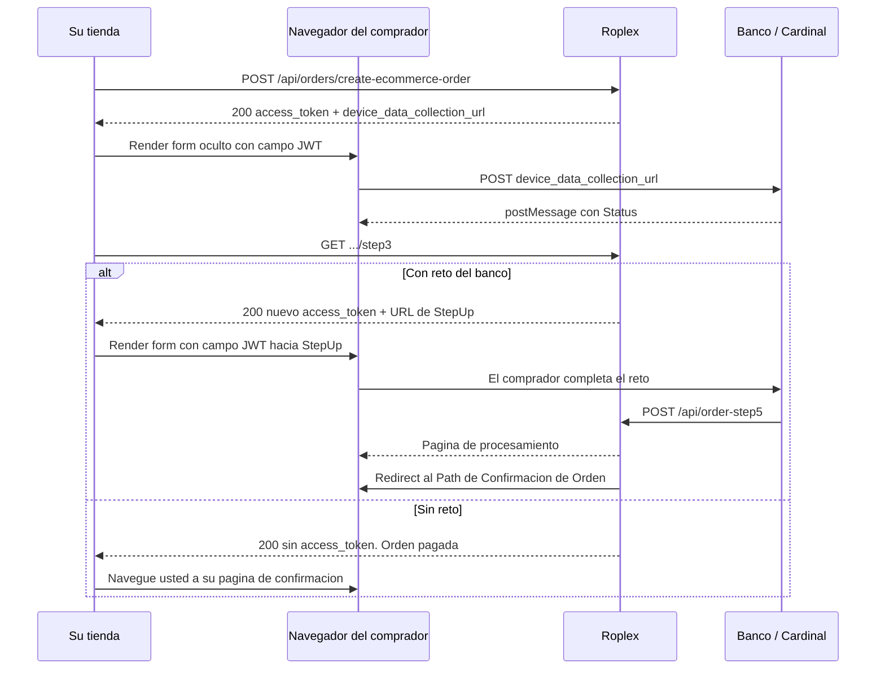
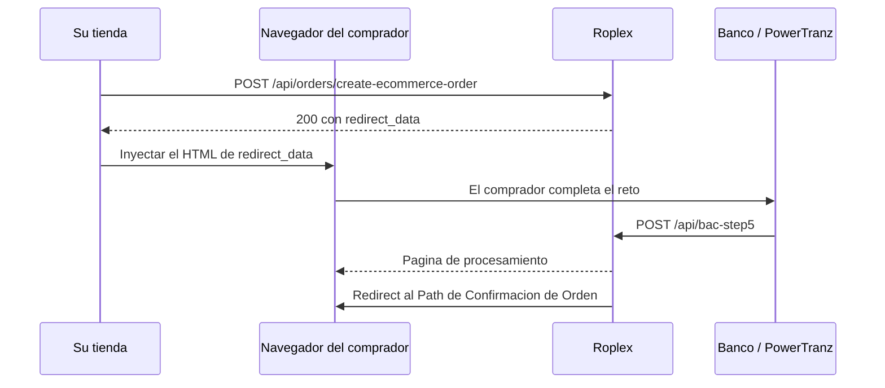

Con NeoPay y con BAC PowerTranz, el cobro **no termina en la respuesta del checkout**. La orden se crea en estado `Procesando` y el cobro solo se completa cuando el comprador pasa la autenticación de su banco.

Si su tienda trata la respuesta 200 del checkout como "pagado", va a mostrar confirmaciones de órdenes que nunca se cobraron. Esta página describe lo que falta hacer.

## Qué hace cada actor

Su tienda nunca habla con el banco. El que habla con el banco es **el navegador del comprador**, y quien recibe la respuesta del banco es **Roplex**, no usted.

| Actor | Responsabilidad |
|---|---|
| Su backend | Llama al checkout y, en NeoPay, al paso 3 |
| El navegador del comprador | Envía formularios al servicio de autenticación y muestra el reto del banco |
| Roplex | Recibe el retorno del banco, cierra el cobro y redirige al comprador a su tienda |

Por eso el resultado final le llega como una **visita a su Path de Confirmación de Orden**, no como una respuesta HTTP a una llamada suya.

## NeoPay



### Paso 1: crear la orden

La respuesta 200 del checkout trae:

```json
{
  "order_id": "3f2c…-uuid",
  "gift_card": null,
  "message": "Orden creada - Pago pendiente",
  "payment_response": {
    "success": true,
    "user_message": "Pendiente de cobro",
    "neo_pay_request_id": 123,
    "access_token": "<JWT>",
    "device_data_collection_url": "https://centinelapi….cardinalcommerce.com/V1/Cruise/Collect"
  }
}
```

| Campo | Tipo | Para qué sirve |
|---|---|---|
| `neo_pay_request_id` | number | Identifica el intento de cobro. Lo necesita en el paso 3. |
| `access_token` | string | Token que se envía al servicio de autenticación. |
| `device_data_collection_url` | string | URL a la que se envía ese token. |

La orden queda en `processing`. No se envía correo ni se sincroniza con Zauru todavía.

Si el paso 1 falla, **la orden no se crea** y la respuesta es HTTP 400 o 500.

### Paso 2: recolección de datos del dispositivo

En el navegador del comprador, envíe `access_token` a `device_data_collection_url` con un formulario oculto. El campo se llama exactamente **`JWT`**, en mayúsculas:

```html
<iframe name="ddc-iframe" style="display: none; height: 1px; width: 1px"></iframe>

<form id="ddc-form" target="ddc-iframe" method="POST" action="DEVICE_DATA_COLLECTION_URL">
  <input type="hidden" name="JWT" value="ACCESS_TOKEN" />
</form>

<script>
  document.getElementById("ddc-form").submit();
</script>
```

El servicio responde con un `postMessage` al `window` de su página. Espere ese mensaje antes de continuar:

```javascript
window.addEventListener("message", (event) => {
  // El origen es el host de device_data_collection_url
  try {
    const data = JSON.parse(event.data);
    if (data && data.Status) {
      // Listo para el paso 3
      ejecutarPaso3();
    }
  } catch (e) {
    // Mensaje no JSON, ignorar
  }
});
```

Este paso es invisible para el comprador: el iframe mide un píxel.

### Paso 3: consultar el resultado de la autenticación

```text
GET /api/orders/{order_id}/neo_pay_request/{neo_pay_request_id}/step3
```

**Headers:**

| Header | Valor |
|---|---|
| Authorization | `users API-Key <clave>` |

Sin body y sin query params.

```bash
curl "https://<host-roplex>/api/orders/3f2c…-uuid/neo_pay_request/123/step3" \
  -H "Authorization: users API-Key <clave>"
```

> **Advertencia:** el paso 3 **no se puede repetir**. Un segundo intento sobre el mismo cobro devuelve HTTP 400 con `Este paso ya fue realizado, no se puede repetir` en el `user_message`.

Hay dos resultados posibles, y se distinguen por la presencia de `access_token`.

**Con reto del banco.** El emisor exige que el comprador se autentique:

```json
{
  "success": true,
  "message": "Pago pendiente de completar. (Proseguir con paso 4).",
  "order_id": "3f2c…-uuid",
  "neo_pay_response": {
    "success": true,
    "user_message": "Pago pendiente",
    "neo_pay_request_id": 123,
    "access_token": "<JWT nuevo>",
    "device_data_collection_url": "https://centinelapi….cardinalcommerce.com/V2/Cruise/StepUp"
  }
}
```

El token y la URL son **nuevos**, distintos a los del paso 1. Continúe con el paso 4.

**Sin reto.** El banco aprobó directamente:

```json
{
  "success": true,
  "message": "Pago realizado correctamente",
  "order_id": "3f2c…-uuid",
  "neo_pay_response": {
    "success": true,
    "user_message": "Pago realizado correctamente",
    "neo_pay_request_id": 123
  }
}
```

Aquí `access_token` y `device_data_collection_url` **no vienen**. La orden ya quedó pagada, el correo salió y la orden se envió a Zauru y a los webhooks.

En este caso **Roplex no redirige a nadie**: es su tienda la que debe llevar al comprador a su página de confirmación.

### Paso 4: el reto del banco

Envíe el **nuevo** token a la **nueva** URL, otra vez con el campo `JWT`. Esta vez el destino debe ser visible, porque el comprador tiene que interactuar:

```html
<iframe id="step_up_iframe" name="stepUpIframe" height="800" width="400"></iframe>

<form id="step_up_form" name="stepup" method="POST" target="stepUpIframe" action="STEP_UP_URL">
  <input type="hidden" name="JWT" value="NUEVO_ACCESS_TOKEN" />
</form>

<script>
  document.getElementById("step_up_form").submit();
</script>
```

También funciona con `target="_blank"` en una pestaña nueva, que es lo que hace la herramienta de pruebas de Roplex.

Su tienda **no** envía `creq` ni `TermUrl`: esos datos viajan dentro del token.

### Paso 5: el retorno

A partir de aquí no interviene su código. El banco envía al navegador del comprador a Roplex:

```text
POST https://<host-roplex>/api/order-step5?neo_pay_request_id={id}&user_id={id}
```

Roplex muestra una página de procesamiento y cierra el cobro. Si sale bien, la orden pasa a `Pagada`, se encola el correo y se envía a Zauru y a los webhooks.

Después redirige el navegador a su tienda, con las URLs que se explican más abajo.

## BAC PowerTranz



BAC no tiene paso 3: es más corto que NeoPay.

### Paso 1: crear la orden

```json
{
  "order_id": "3f2c…-uuid",
  "gift_card": null,
  "message": "Orden creada - Pendiente de autenticación 3D-Secure",
  "payment_response": {
    "success": true,
    "message": "Proceso de autenticación 3D-Secure iniciado",
    "user_message": "Procesando autenticación",
    "bac_request_id": 13,
    "spi_token": "<token>",
    "redirect_data": "<!DOCTYPE html>…",
    "requires_payment": false,
    "requires_3ds_authentication": false
  }
}
```

> **Advertencia:** no use `requires_3ds_authentication` ni `requires_payment` para decidir si hay que autenticar. Hoy ambos llegan siempre en `false`, incluso cuando la autenticación sí es necesaria. **Use la presencia de `redirect_data`.**

Con `redirect_data` la orden queda en `processing`. Sin `redirect_data`, queda `paid` y la orden ya se envió a Zauru y a los webhooks; navegue usted a su página de confirmación.

`spi_token` es informativo. Su tienda no lo envía a ningún lado: ya viene dentro de `redirect_data`.

### Paso 2: inyectar el HTML

`redirect_data` **no es una URL**: es un documento HTML completo, con un formulario que se envía solo mediante un script.

Debe inyectarlo de forma que **los scripts se ejecuten**. Asignarlo a `innerHTML` no funciona, porque los scripts no corren:

```javascript
const ventana = window.open("", "_blank");

if (!ventana) {
  // El navegador bloqueó la ventana emergente
  mostrarError("Permita las ventanas emergentes para completar el pago");
  return;
}

ventana.document.open();
ventana.document.write(respuesta.payment_response.redirect_data);
ventana.document.close();
```

No intente extraer el token y reconstruir el formulario por su cuenta: el HTML incluye datos del navegador que el banco necesita.

### Paso 3: el retorno

El banco envía al navegador del comprador a Roplex:

```text
POST https://<host-roplex>/api/bac-step5?bac_request_id={id}&user_id={id}
```

Roplex muestra su página de procesamiento, cierra el cobro y redirige a su tienda. Con el cobro aprobado, la orden pasa a `Pagada`, sale el correo y se envía a Zauru y a los webhooks.

## QPayPro no usa este flujo

QPayPro resuelve el cobro dentro de la propia llamada al checkout y **no tiene retorno a Roplex**. La respuesta trae un `redirect_url` que ya apunta a su tienda:

```text
https://tienda.ejemplo.com/confirmacion-de-orden/<order_id>?status=success
```

Lleve al comprador ahí. Ver [Pasarelas de pago](/checkout/pasarelas-de-pago#qpaypro).

## A dónde vuelve el comprador

Roplex construye la URL de retorno con el origen del link registrado en **URLs de Sitios de Comercio** para el ambiente actual, más el path configurado en el sitio.

| Resultado | URL |
|---|---|
| Éxito | `{origen}{Path de Confirmación de Orden}/{order_id}` |
| Error o tiempo agotado | `{origen}{Path de Error de Pago}?timeout=true` |

Con los valores por defecto:

```text
https://tienda.ejemplo.com/confirmacion-de-orden/3f2c…-uuid
https://tienda.ejemplo.com/pago?timeout=true
```

Dos detalles que importan al programar esas páginas:

- La URL de **éxito** trae el `order_id` como último segmento del path.
- La URL de **error** **no** trae el `order_id`. Si necesita identificar la orden en el fallo, guárdela en la sesión del comprador antes de mandarlo al banco.

## Estados, correo y sincronización

**NeoPay:**

| Momento | Estado de la orden | Correo | Zauru y webhooks |
|---|---|---|---|
| Se crea la orden | `processing` | No | No |
| Paso 3 con reto | `processing` | No | No |
| Paso 3 sin reto | `paid` | Sí | Sí |
| Retorno del banco, aprobado | `paid` | Sí | Sí |
| Tiempo agotado con la pasarela | `failed` | No | No |
| El comprador abandona el reto | `processing` | No | No |

**BAC:**

| Momento | Estado de la orden | Correo | Zauru y webhooks |
|---|---|---|---|
| Se crea la orden con `redirect_data` | `processing` | No | No |
| Se crea la orden sin `redirect_data` | `paid` | No | Sí |
| Retorno del banco, aprobado | `paid` | Sí | Sí |
| Autenticación fallida | `processing` | No | No |
| El comprador abandona el reto | `processing` | No | No |

## Órdenes abandonadas

Si el comprador cierra el navegador durante el reto, **la orden queda en `Procesando` indefinidamente**. No hay caducidad ni limpieza automática: no se cobra, no sale correo y no se envía a Zauru.

Considere revisar periódicamente las órdenes que llevan mucho tiempo en `Procesando` y descartarlas de su lado.

## Confirmar el resultado desde su backend

No hay un endpoint de estado de pago. Para confirmar el desenlace de una orden, léala con su clave de API:

```bash
curl "https://<host-roplex>/api/orders/<order_id>" \
  -H "Authorization: users API-Key <clave>"
```

| Valor de `state` | Significado |
|---|---|
| `processing` | Sigue en autenticación, o el comprador nunca volvió |
| `paid` | El cobro se completó |
| `failed` | La pasarela agotó el tiempo y el cobro se revirtió |

Úselo como respaldo, no como mecanismo principal: la señal normal de que todo salió bien es la visita del comprador a su **Path de Confirmación de Orden**.

## Troubleshooting

**El reto del banco no se abre**
Con BAC, casi siempre es el bloqueador de ventanas emergentes. Verifique que `window.open` devolvió una ventana y avísele al comprador si no. También revise que esté usando `document.write` y no `innerHTML`: con `innerHTML` los scripts no se ejecutan y el formulario nunca se envía.

**HTTP 400 con `Este paso ya fue realizado, no se puede repetir`**
Se llamó dos veces al paso 3 para el mismo cobro. Es común cuando el `postMessage` de la recolección de datos llega más de una vez. Marque el paso 3 como ejecutado en su código antes de llamarlo.

**HTTP 404 `Order not related to NeoPay Request`**
El `order_id` y el `neo_pay_request_id` de la URL no corresponden al mismo cobro. Ambos vienen de la misma respuesta del checkout.

**El comprador aterrizó en el Path de Error con `?timeout=true`**
El cobro tardó más de lo permitido. La orden puede haber quedado en `failed`. Consúltela por su id antes de decidir si vuelve a cobrar.

**HTTP 400 `American Express no es soportado por NeoPay`**
Es una limitación de esa pasarela. Si necesita Amex, use QPayPro o BAC.

**El comprador pagó pero la orden sigue en Procesando**
El banco no llegó a enviar al navegador de vuelta a Roplex, normalmente porque el comprador cerró la ventana del reto. Revise el estado leyendo la orden y, si hace falta, reenvíela desde el admin.
