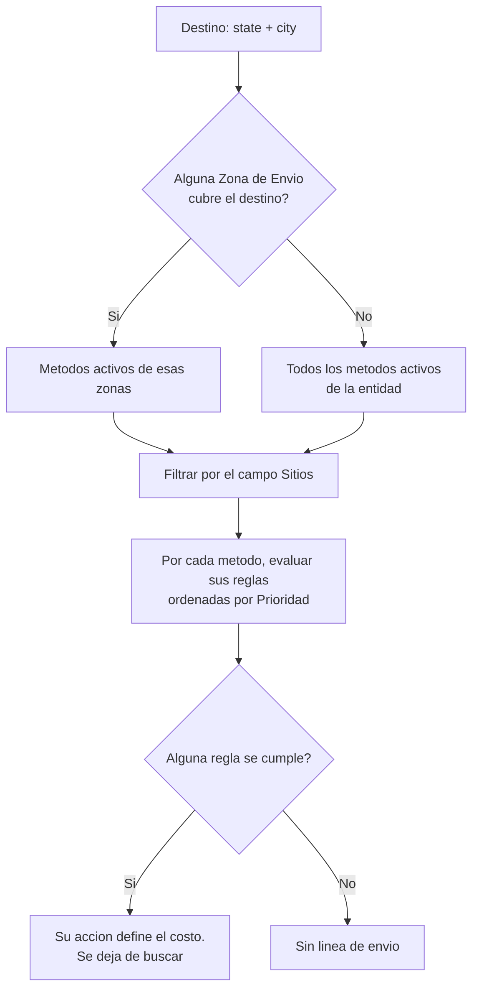

El costo de envío no viene en el body del checkout. Roplex lo calcula a partir de la configuración de la entidad y de la dirección que envía la tienda, y lo agrega como una línea más de la orden.

La excepción es la recolección en tienda: si `store_pickup` llega como `true`, `"true"` o `"1"`, no se calcula envío, no se agrega línea y el memo de la orden incluye `Recolección en tienda`.

## Campos del request que entran al cálculo

| Campo | Uso |
|---|---|
| `state` | Id del estado o departamento de destino. Determina el país del destino. |
| `city` | Id numérico del municipio, o su nombre exacto. Si envía el nombre, Roplex lo busca dentro del estado ya resuelto. |
| `coupon` | Código de cupón, para reglas cuyo tipo de condición es **Cupón**. |
| `postal_code` | Se guarda en el contexto del cálculo, pero hoy ninguna regla lo evalúa. |

`address_line_1` y `delivery_instructions` se guardan en la orden y viajan a Zauru y a los webhooks, pero no afectan la tarifa.

Ver [Campos del endpoint](/checkout/campos) para el formato de cada uno.

## Cómo se decide el costo

Si ninguna zona cubre el destino, el cálculo no se detiene: continúa con todos los métodos activos de la entidad. Si al final ningún método aplica o ninguna regla se cumple, el costo queda vacío y **la orden se crea sin línea de envío**.

## Configuración en el admin

Todo esto vive en el grupo **Shipping** del menú lateral y pertenece a la entidad, no al sitio. Los usuarios con rol `admin` o `shop_manager` pueden crearlo y editarlo.

### Zonas de Envío

Una zona describe a qué destinos llega la tienda.

| Campo | Para qué sirve |
|---|---|
| **Nombre** | Identifica la zona. |
| **Descripción** | Texto libre, opcional. |
| **Ubicaciones Asociadas** | Una o más filas. Cada fila combina **País**, **Estados** y **Ciudades**. |

Dentro de cada fila de **Ubicaciones Asociadas**:

- **País**: si se deja vacío, aplica a todos los países.
- **Estados**: estados del país seleccionado. Vacío significa todos los estados.
- **Ciudades**: ciudades de los estados seleccionados. Vacío significa todas las ciudades.

El destino coincide con la zona cuando cumple los tres niveles que sí estén definidos. Basta con que **una** fila coincida para que la zona aplique.

### Métodos de Envío

Un método es una forma concreta de entregar, con su propia tarifa.

| Campo | Para qué sirve |
|---|---|
| **Zona de Envío** | Zona a la que pertenece el método. Obligatorio. |
| **Nombre** | Identifica el método. |
| **Tipo** | Etiqueta el método: **Tarifa Plana**, **Por Peso**, **Por Precio**, **Por Distancia** o **API de Transportista**. El tipo es descriptivo: el costo lo definen las reglas. |
| **Item de Envío** | Ítem del catálogo que representa el cobro del envío. Es la línea que se agrega a la orden, con cantidad 1 y precio igual al costo calculado. El selector solo lista ítems activos, vendibles y no inventariables. |
| **Activo** | Encendido por defecto. Los métodos apagados no se evalúan. |
| **Sitios** | Sitios de ecommerce donde está disponible el método. Vacío significa todos los sitios de la entidad. |

> **Advertencia:** un método sin **Item de Envío** nunca se evalúa, aunque esté activo y tenga reglas.

### Reglas de Métodos de Envío

Las reglas no aparecen en el menú lateral. Se crean y editan desde el propio método, en la lista de reglas al final del formulario.

| Campo | Para qué sirve |
|---|---|
| **Método de Envío** | Método al que pertenece la regla. |
| **Tipo de Condición** | Qué se compara. Ver la tabla siguiente. |
| **Operador** | Cómo se compara. |
| **Valor de Condición** | Valor numérico o de texto contra el que se compara. |
| **Tipo de Acción** | Qué se hace si la condición se cumple. |
| **Valor de Acción** | Valor numérico de la acción. |
| **Moneda** | Moneda del **Valor de Acción**. Si se deja vacía, se asume GTQ. |
| **Prioridad** | Orden de evaluación dentro del método. Menor número se evalúa primero. |

**Tipos de Condición:**

| Opción | Se compara contra |
|---|---|
| **Precio Mínimo** / **Precio Máximo** | Total de los ítems de la orden |
| **Peso Mínimo** / **Peso Máximo** | Peso total de la orden |
| **Cupón** | Valor de `coupon` en el body |
| **Distancia** | Distancia al destino |
| **Grupo de Cliente** | Grupo del cliente |

**Operadores:** **Igual (=)**, **Menor o Igual (&lt;=)**, **Mayor o Igual (&gt;=)**, **En Lista (IN)** y **Entre Valores (BETWEEN)**.

**En Lista (IN)** espera un **Valor de Condición** separado por comas: `20,30,40`. **Entre Valores (BETWEEN)** espera dos números separados por coma, mínimo y máximo: `20,50`.

**Tipos de Acción:**

| Opción | Costo resultante |
|---|---|
| **Establecer Precio** | El **Valor de Acción** |
| **Gratis** | 0 |
| **Descuento** | 0 hoy, ver la advertencia siguiente |

Dentro de un método, la primera regla que se cumple define el costo y la evaluación se detiene. Si ninguna regla del método se cumple, se pasa al siguiente método.

## Limitaciones actuales

Tres comportamientos que conviene conocer antes de configurar reglas:

- **Las reglas por peso siempre ven peso 0.** Las líneas que arma el checkout no llevan peso, así que **Peso Mínimo** solo se cumple con valores menores o iguales a cero, y **Peso Máximo** se cumple siempre.
- **Las reglas por Distancia y Grupo de Cliente nunca se cumplen.** El cálculo no recibe ninguno de esos dos datos, así que la condición se evalúa como falsa.
- **La acción Descuento produce costo 0.** Se aplica sobre un precio base que hoy siempre es cero, con lo que su resultado es idéntico al de **Gratis**. Use **Establecer Precio** si necesita una tarifa distinta de cero.

## Conversión de moneda

El costo se define en la **Moneda** de la regla. Si esa moneda es distinta a la moneda de cobro de la orden, Roplex la convierte usando las **Tasas de Cambio** de la entidad. Si no hay tasa disponible, se usa el monto tal cual.

## Troubleshooting

**La orden se crea sin línea de envío**
Alguna de estas tres: ningún método activo de la entidad tiene **Item de Envío**, ningún método aplica al sitio actual según su campo **Sitios**, o ninguna regla se cumplió. Revise en ese orden.

**El envío sale gratis cuando no debería**
Revise si la regla que se está cumpliendo usa **Descuento** como **Tipo de Acción**. Hoy esa acción devuelve 0. Cámbiela a **Establecer Precio**.

**La regla de peso no se comporta como se espera**
Es esperado: el peso de la orden siempre llega en 0. Use condiciones de precio en su lugar.

**El destino no cae en la zona correcta**
Verifique que `city` llegue como id numérico o con el nombre exactamente igual al registrado. Si el nombre no coincide, la ciudad no se resuelve y la zona que filtra por ciudad no aplica.
